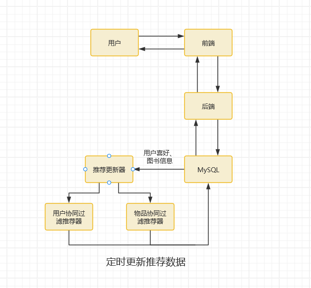

---
output:
  word_document
---

# 图书推荐系统

本项目为图书推荐系统，旨在基于用户兴趣和图书内容提供个性化的推荐服务。系统所使用的数据集来自 [goodbooks 10k](https://github.com/zygmuntz/goodbooks-10k)，目前已完成核心功能开发，并搭建了线上 Demo，地址为：[http://121.41.114.45:10000/](http://121.41.114.45:10000/)。支持根据图书推荐图书以及根据用户偏好推荐图书。

## 一、系统设计

本系统采用前后端分离架构，前端使用 Vue3 技术栈开发，后端基于 Python Flask 框架搭建，数据库使用 MySQL 进行数据存储。推荐算法采用离线推荐，通过定时任务来计算用户的推荐列表，并存入数据库供查询。



### 前端

前端部分采用 Vue3 组合式 API，利用其良好的组件化特性提升了代码复用率和可维护性。全局状态管理使用 Pinia，方便对用户信息、图书数据、用户收藏等核心数据进行统一管理。系统路由基于 vue-router 实现，支持多页面跳转与参数传递。前后端数据交互通过 axios 调用 RESTful API，所有接口统一封装，确保调用便捷且易于维护。

前端页面主要包括四个部分：首页、图书详情页、用户收藏页和登录页。首页用于展示图书列表和系统推荐内容，图书详情页提供单本图书的详细信息及相关推荐，并提供了 goodreads 的对应跳转 (可能需要梯子)。用户收藏页展示当前用户喜欢的图书集合，登录页则设计为简洁的用户 ID 登录模式，便于快速体验。

### 后端

后端部分整体架构清晰，功能划分明确。系统主要包含 API 层、服务层、数据模型层和工具层。API 层负责处理前端请求，服务层封装图书查询、用户推荐等核心业务逻辑，数据模型层定义了与数据库对应的数据结构，工具层则集成了数据导入、推荐算法等功能。

系统推荐算法的设计充分结合了图书内容和用户行为，推荐策略包括基于图书内容的相似性推荐（如作者、语言、出版年份等特征比对）以及基于协同过滤的个性化推荐（包括基于用户的协同过滤 UserCF 和基于物品的协同过滤 ItemCF）。推荐结果会定期写入 `userRecommend` 和 `bookRecommend` 两张数据库表，前端通过实时查询为用户展示最新推荐。

数据库设计上，本系统采用结构简洁且高效的表结构。书籍信息表（`bookInfo`）记录了书籍的核心属性，包括书名、封面、作者、出版年份、语言类型、平均评分等。用户书籍表（`favor`）记录用户与所喜欢书籍的对应关系，用于个性化推荐计算。用户推荐表（`userRecommend`）和书籍推荐表（`bookRecommend`）分别存储用户与书籍的推荐结果，定期更新，确保推荐内容的时效性。

## 二、系统部署

### 前端

> 需要 node22+ 环境, 安装 pnpm

1. 进入 frontend 目录  
2. 在目录下的 .env.production 内将 apiUrl 为实际后端部署 url  
3. 运行

    ```bash
    pnpm build
    ```

构建产物存在目录下的 dist 目录内, 为静态页面, 配置静态网站托管即可部署

### 后端

1. 进入 backend 目录
2. 安装 requirements.txt 的库

   ```bash
   pip install -r requirements.txt
   ```

3. 部署 MySQL 服务, 按 db.py 中的定义配置数据库用户与表
4. 在 utils 目录下创建 origin_data, 将对应的数据文件放入其中, 分别运行 importBooks.py 与 importFavors.py, 将数据导入数据库中
5. 启动项目, 将监听 5000 端口

   ```bash
   python main.py
   ```

6. 设置定时计划, 定期执行 backend/utils/upRecommend.py 对推荐内容进行更新
